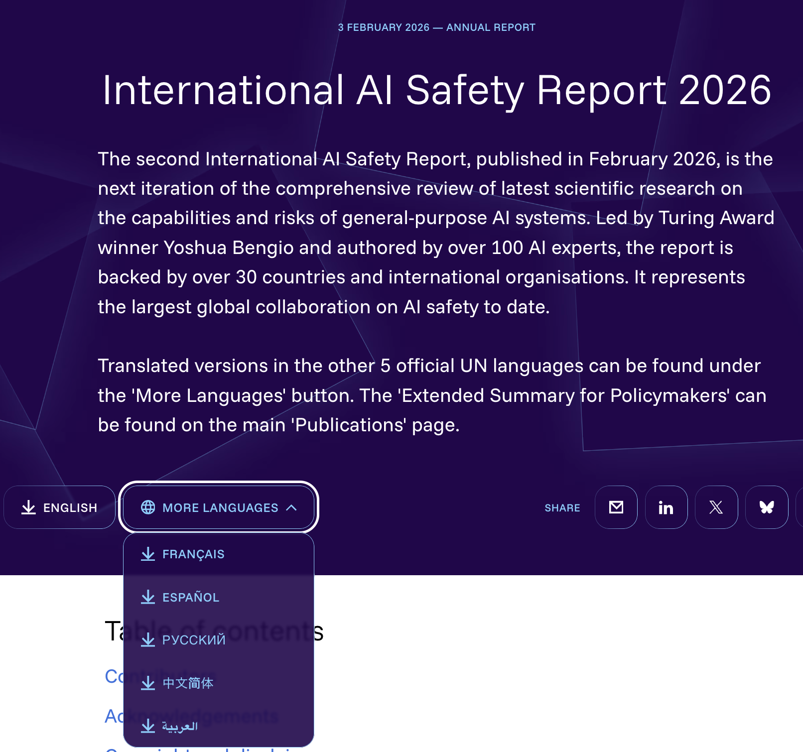

# Tenzing-GOV

This site hosts the translated markdown files that complement the official translations by internationalaisafetyreport.org to help facilitate the penetration of the AI safety report. As listed in **Machine Translation** section below, six new languages were added to this repo on May 13(Wed), 2026; 18 more will be added on May 20(Wed), 2026.

PDF's built from the translated markdown files on this repository are also posted on [Tenzing-Arxiv](https://github.com/tetsuoseto/Tenzing-Arxiv/blob/main/iaisr/docgen/gov/) repository with 'Preview' status. On this repository, the markdown files are initially all in 'pristine' state -- machine translated with no human edits. The markdown files can be collaboratively proofread, i.e., edit text, fine-tune PDF formatting, localize image files, rebuild PDF, repeat the steps, then, finally remove the W.I.P. watermark and upgrade to 'Published' status on [Tenzing-Arxiv](https://github.com/tetsuoseto/Tenzing-Arxiv/blob/main/iaisr/docgen/gov/) repository.

## Translation Data Sheet

### Source
- Source language: en-GB
- Source files: [international-ai-safety-report-2026.pdf](https://internationalaisafetyreport.org/sites/default/files/2026-02/international-ai-safety-report-2026.pdf)
- Source license: [Open Government License v3.0](https://www.nationalarchives.gov.uk/doc/open-government-licence/version/3/)

### Markdown
- Markdown customization plugin: [Plugin Python URL](https://github.com/tetsuoseto/Tenzing/blob/main/docgen/tenzing_register_GOV_plugin.py), [Custom Data URL](https://github.com/tetsuoseto/Tenzing/tree/main/docgen/tenzing_data_GOV)

### Machine Translation
- Machine translation languages (May 13, 2026): de-DE, it-IT, ja-JP, ko-KR, zh-TW, vi-VN
- Machine translation languages (scheduled for May 20, 2026): be-BY, pt-PT, fi-FI, no-NO, sv-SE, nl-NL, da-DK, et-EE, lv-LV, lt-LT, pl-PL, hu-HU, cs-CZ, el-GR, tr-TR 
- Machine translation model: gpt-5.4-nano

### Proofread (to-be-done)
- Proofreader(s):
  - proofreader_name_1 ( https://github.com/proofreader_name_1/ )                                            
  - proofreader_name_2 ( https://github.com/proofreader_name_2/ )                                            
  - proofreader_name_3 ( https://github.com/proofreader_name_3/ )                                            

### PDF Creation
- Creation tool: [TENZING v5.2.3](https://github.com/tetsuoseto/Tenzing-Release)

### PDF Archive
- https://github.com/tetsuoseto/Tenzing-Arxiv/blob/main/iaisr/docgen/gov/
- Archive status: Preview
- PDF license: [Creative Commons Attribution Share Alike 4.0 International](https://creativecommons.org/licenses/by-sa/4.0/)
 